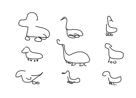

# Derek Cheung - code examples

A few examples of code that I've written.

## Python

Notebook experiment to predict image properties like RGB and reflectivity using CNNs and
Blender:

[Material Eyedropper](Material_Eyedropper.ipynb)

Documented code complete with unit tests, passes `pylint` and `black` autoformatting:

[Three Card Poker, 2020](three_card_poker.py)

## TensorFlow

### M.Sc. thesis source code excerpts

_Figure 1: Sketch drawings of a blend between a duck and a pair of rollerskates, generated
by the wide search technique presented in my master's thesis._

Excerpts from the source code for my master's thesis, _Visual blending in sketch drawings
using variational autoencoders_. Thesis text (in Spanish) is available online through the
library of the National Autonomous University of Mexico at: http://tesis.unam.mx
(original title: _Mezcla visual entre dibujos usando autocodificadores variacionales_).

[TensorFlow amortizer model, 2018](tensorflow_amortizer.py)

[TensorFlow wide search model, 2018](tensorflow_wide_search.py)

## c code
[mmap helper, 2016](mmap.c)
